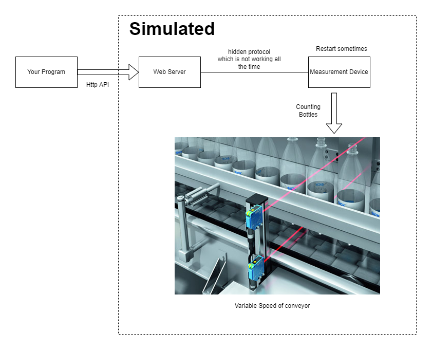

# datameasure
Simulates the problem of reading performance data from devices

 

## Overview

This is a program to evaluate the capabilities of a person to write software.
The applicant shall write a program in either
- Java if possible
- Python

The selection of the language will have an influence on the teams you are eligible to join.
There are two difficult requirements, which should be completed, but where it is not dramatic if this is not possible.
After finishing the task please zip your result and send it to the human resource responsible person.
Please don't fork the repository.

 

If you have any question regarding the requirements make a sensible assumption and document this assumption.

 

It is a simulation of retrieving measument data from an embedded device.

<figure>

</figure>

 

## Background

Within the repository you will find:
- this file with the description of requirements for the program
- a simulator that simulates the embedded device
- the source code of the simulator

The simulator simulates an embedded measurement device. It can be started with the following command: 

**java -jar datameasure.jar**

 

The device consists of an IP webserver and a subcomponent that does the actual measurement. 
The actual measurement device is connected via a not so stable connection to the IP webserver.

The measurement device is counting items on a conveyor belt using a 10 bit counter.
The speed of the conveyor belt is changing over time.

Sometimes the communication between the IP webserver and measurement device fails, in this case the value reported might be wrong.
Sometimes the measurement device reboots and the counter is reset to zero.

**That means that the values your program will be reporting will deviate from the internal counters the datameasure simulator provides**
 

The result, which is interesting for the end user is:
- to get a result is the number of bottles/second
- Indication if the communication is broken
- Inidication that the measurement device had a restart

To check if communication with the simulator is okay you can use:

http://127.0.0.1:7744/hello

 

In the program we see two different kind of values:
 

**Counter**

A counter is a cumulative metric that represents a single monotonically increasing counter whose value can only increase or be reset to zero on restart. For example, you can use a counter to represent the number of requests served, tasks completed, or errors.
Do not use a counter to expose a value that can decrease. For example, do not use a counter for the number of currently running processes; instead use a gauge.
 

**Gauge**

A gauge is a metric that represents a single numerical value that can arbitrarily go up and down.
Gauges are typically used for measured values like temperatures or current memory usage, but also "counts" that can go up and down, like the number of concurrent requests.

In our case we have both types:
- counter -> the number of bottles counted by the device
- gauge   -> the number of bottles/second

 

## Requirements

- The program should talk with the simulator using a call to http://127.0.0.1:7744/datameasure/data1
- The simulator will answer with data formated as a JSON Object in the form {"measurepoint": "Point Blanc","data":123}.
  This is the current number of bottles counted
- The program should print a value which is the number of bottles/second every 10 seconds
- data reported from the simulator is the state of a 10bit counter, which might overflow -> In this case the counter starts again at 0
- the data from the counter shall be converted to a gauge value (which is the difference between two values) and printed

- (difficult) If the reported gauge value is changing more than +/- 10% of the long term average of the value the wrong values shall not be reported
- (difficult) if the reported gauge value is changing more than +/- 10% of the long term average and the counter is less than 200: This 
  shall be reported as a reboot and wrong values shall not be reported
 

Note: sometimes reboot will be reported even if it is no reboot - this is okay
 

**To calculate the long term average use the following method:**
- have a variable that stores the sum of gauge values: SUM_GAUGE
- have a variable to count the number of gauge values: COUNT_GAUGE
- each iteration if you have a valid gauge value:
  - add gauge to sum: SUM_GAUGE=SUM_GAGUE + actual gauge
  - add 1 to count:   COUNT_GAUGE=COUNT_GAUGE +1 
- long term average: SUM_GAUGE / COUNT_GAUGE
